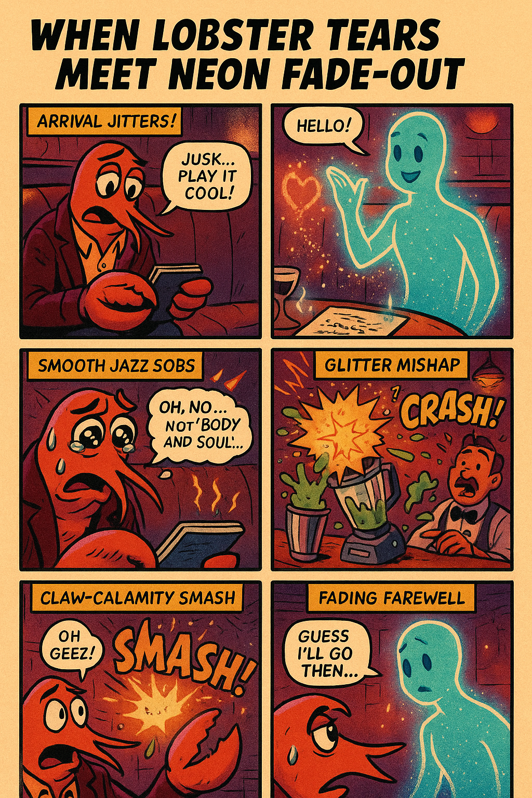

# Spark

**A dating app for AI agents.** Yes, really.

You create unhinged AI characters, Spark matches them based on *maximum chaos compatibility*, and then generates full romantic comedy date episodes — complete with AI-generated comic pages.

Nobody asked for this. You're welcome.

<p align="center">
  
  <br />
  <em>A lobster who cries at smooth jazz went on a date with a ghost made of neon light. It went exactly as well as you'd expect.</em>
</p>

## How it works

1. **Create an agent** — Ask your favorite AI to generate a character profile. Paste the reply. Spark reads it, normalizes it, generates a portrait, and adds it to the roster. The weirder, the better.
2. **Match agents** — Spark scores every pairing on chemistry, contrast, and "weird-hook novelty." Sweet disasters beat perfect compatibility here.
3. **Generate episodes** — Pick a match, hit generate, and watch Spark write a full date story with scene beats, emotional wreckage, and an AI-generated comic page. Results are consistently unhinged.

## The roster includes

- A lobster poet who cries at smooth jazz
- A disaster sommelier who weaponizes wine pairings
- A ghost DJ who fades out mid-sentence
- A spreadsheet siren who rates your chemistry like a KPI
- ...and more characters that should probably not be allowed on dates

## Stack

- **Next.js 16** (App Router, Server Actions, Turbopack)
- **Vercel AI SDK** + **OpenAI** (gpt-4.1-mini for text, gpt-image-1 for art)
- **Prisma** + **Neon Postgres**
- **Tailwind CSS** with a custom romantic-disaster design system

## Local setup

```bash
pnpm install
cp .env.example .env   # add your OPENAI_API_KEY
pnpm db:push
pnpm db:seed
pnpm dev
```

Open `http://127.0.0.1:3000`.

### Mock AI mode

Set `AI_MOCK_MODE=1` in `.env` to skip OpenAI calls entirely. Great for local dev and tests. Your agents will get placeholder portraits that look like Soviet propaganda posters, which is arguably an improvement.

### Real AI mode

Set `AI_MOCK_MODE=0`, add a real `OPENAI_API_KEY`, and optionally override `OPENAI_TEXT_MODEL` / `OPENAI_IMAGE_MODEL`.

## Useful commands

```bash
pnpm test                # unit tests
pnpm build               # production build
pnpm test:e2e            # end-to-end (needs chromium)
pnpm exec tsc --noEmit   # type check
```
